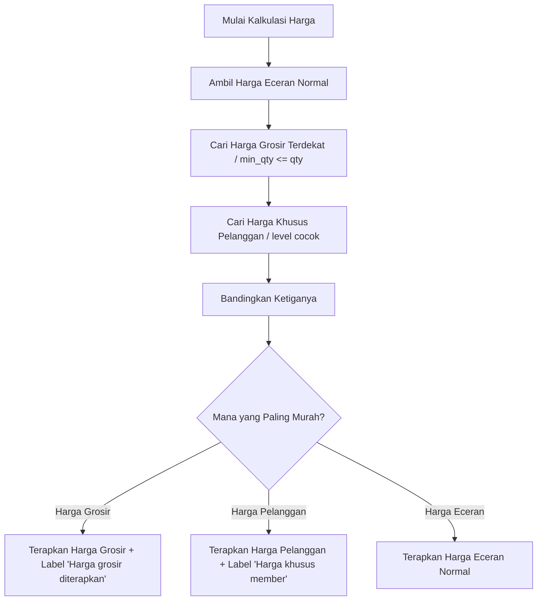

# Issue: Fitur Harga Bertingkat Otomatis di POS Kasir

## Deskripsi
Fitur **Harga Bertingkat Otomatis** dikembangkan untuk memudahkan kasir memberikan harga terbaik kepada pelanggan secara otomatis berdasarkan kuantitas barang yang dibeli (harga grosir/grup qty) atau level pelanggan (ecer, grosir, agen, vip).

Sistem akan mengevaluasi harga dari tabel `product_prices` secara instan ketika kuantitas (`qty`) item di keranjang belanja berubah atau ketika unit barang diubah. Harga akhir yang diberikan kepada pelanggan adalah **harga termurah** setelah membandingkan:
1. **Harga Grosir** (berdasarkan kuantitas minimum `min_qty` pada unit terkait).
2. **Harga Khusus Pelanggan** (berdasarkan level pelanggan aktif).
3. **Harga Eceran Normal** (harga dasar terendah dari master produk `harga_jual_min` dikalikan dengan conversion factor unit).

---

## Rencana Implementasi



### 1. Model Baru: `ProductPriceModel`

Buat model baru di [product_price_model.dart](file:///home/adi/Projects/pos_toko_plastik/lib/data/models/product_price_model.dart) untuk menampung data dari tabel `product_prices`.

```dart
import 'package:equatable/equatable.dart';

class ProductPriceModel extends Equatable {
  final String? id;
  final String productId;
  final String unitId;
  final String priceType; // 'qty_based' atau 'customer_level'
  final int minQty;
  final String? customerLevel; // 'ecer', 'grosir', 'agen', 'vip'
  final double hargaJual;
  final bool isActive;

  const ProductPriceModel({
    this.id,
    required this.productId,
    required this.unitId,
    required this.priceType,
    this.minQty = 1,
    this.customerLevel,
    required this.hargaJual,
    this.isActive = true,
  });

  factory ProductPriceModel.fromJson(Map<String, dynamic> json) {
    return ProductPriceModel(
      id: json['id'] as String?,
      productId: json['product_id'] as String,
      unitId: json['unit_id'] as String,
      priceType: json['price_type'] as String,
      minQty: json['min_qty'] as int? ?? 1,
      customerLevel: json['customer_level'] as String?,
      hargaJual: (json['harga_jual'] as num).toDouble(),
      isActive: json['is_active'] as bool? ?? true,
    );
  }

  Map<String, dynamic> toJson() {
    return {
      if (id != null) 'id': id,
      'product_id': productId,
      'unit_id': unitId,
      'price_type': priceType,
      'min_qty': minQty,
      if (customerLevel != null) 'customer_level': customerLevel,
      'harga_jual': hargaJual,
      'is_active': isActive,
    };
  }

  @override
  List<Object?> get props => [
        id,
        productId,
        unitId,
        priceType,
        minQty,
        customerLevel,
        hargaJual,
        isActive,
      ];
}
```

### 2. Update Model Existing

#### A. **ProductModel** ([product_model.dart](file:///home/adi/Projects/pos_toko_plastik/lib/data/models/product_model.dart))
Tambahkan list `prices` agar informasi harga bertingkat dapat dibawa langsung oleh objek produk, menghindari request database berulang-ulang (network calls) saat kasir menaikkan/menurunkan qty.

```dart
// Tambahkan field baru
final List<ProductPriceModel> prices;

// Tambahkan ke constructor (default [] jika null)
const ProductModel({
  ...
  this.prices = const [],
});

// Update ProductModel.fromJson
prices: json['product_prices'] != null
    ? (json['product_prices'] as List<dynamic>)
        .map((e) => ProductPriceModel.fromJson(e as Map<String, dynamic>))
        .toList()
    : [],
```

#### B. **CartItemModel** ([cart_item_model.dart](file:///home/adi/Projects/pos_toko_plastik/lib/data/models/cart_item_model.dart))
Tambahkan penanda tipe diskon/harga yang sedang aktif untuk merender badge di UI secara instan.

```dart
enum AppliedPriceType { normal, grosir, customerLevel }

// Tambahkan field di CartItemModel
final AppliedPriceType appliedPriceType;

// Set default normal di constructor
const CartItemModel({
  ...
  this.appliedPriceType = AppliedPriceType.normal,
});
```

---

### 3. Modifikasi Repository (`ProductRepository`)
Tambahkan method pencarian harga di [product_repository.dart](file:///home/adi/Projects/pos_toko_plastik/lib/data/repositories/product_repository.dart) dan lakukan query join relasi tabel `product_prices` saat load produk.

#### A. Fetch Join Relasi
Perbarui query `.select()` di `getProducts` agar memuat data `product_prices`.
```dart
    var query = _client
        .from('products')
        .select('*, product_units(*), product_prices(*)')
        .eq('owner_id', _ownerId);
```

#### B. Method `getRecommendedPrice`
Implementasikan pencarian harga terbaik. Agar pencarian ini **berjalan instan (real-time)**, algoritma ini sebaiknya berjalan secara sinkron menggunakan memori lokal dari objek `ProductModel` yang sudah memuat data `product_prices` (offline-first style), namun kita juga tetap menyediakan opsi query database secara dinamis jika dipanggil di luar konteks keranjang belanja.

```dart
  /// Algoritma Pencarian Harga Terbaik (Rekomendasi Harga Terendah)
  /// Dapat dijalankan in-memory jika data product.prices tersedia,
  /// atau mengambil dari database jika dibutuhkan.
  double getRecommendedPrice({
    required ProductModel product,
    required String unitId,
    required double qty,
    String? customerLevel,
    required double conversionToBase,
  }) {
    // 1. Tentukan Harga Eceran Normal berdasarkan unit conversion
    final normalPrice = product.hargaJualMin * conversionToBase;
    double recommendedPrice = normalPrice;

    // Filter harga bertingkat yang aktif dan cocok dengan unitId
    final activePrices = product.prices
        .where((p) => p.unitId == unitId && p.isActive)
        .toList();

    // 2. Cari Harga Grosir (qty_based): min_qty <= qty, ambil min_qty terbesar
    ProductPriceModel? winGrosir;
    for (final price in activePrices) {
      if (price.priceType == 'qty_based' && price.minQty <= qty) {
        if (winGrosir == null || price.minQty > winGrosir.minQty) {
          winGrosir = price;
        }
      }
    }

    // 3. Cari Harga Khusus Pelanggan (customer_level)
    ProductPriceModel? winCustomer;
    if (customerLevel != null && customerLevel.isNotEmpty) {
      for (final price in activePrices) {
        if (price.priceType == 'customer_level' &&
            price.customerLevel == customerLevel) {
          winCustomer = price;
          break;
        }
      }
    }

    // 4. Bandingkan harga untuk mendapatkan nilai paling murah bagi pembeli
    double finalGrosirPrice = winGrosir != null ? winGrosir.hargaJual : normalPrice;
    double finalCustomerPrice = winCustomer != null ? winCustomer.hargaJual : normalPrice;

    double lowest = normalPrice;
    if (finalGrosirPrice < lowest) lowest = finalGrosirPrice;
    if (finalCustomerPrice < lowest) lowest = finalCustomerPrice;

    return lowest;
  }
```

---

### 4. Modifikasi State (`CartCubit`)
Setiap kali quantity berubah (`updateQty`), item ditambahkan (`addToCart`), atau unit diubah (`changeUnit`), hitung ulang harga acuan sistem secara instan.

Modifikasi file [cart_cubit.dart](file:///home/adi/Projects/pos_toko_plastik/lib/logic/pos/cart_cubit.dart):

```dart
  /// Helper untuk menghitung harga & tipe harga yang diterapkan
  CartItemModel _calculateItemPrice(CartItemModel item, double newQty, ProductUnitModel newUnit) {
    // Jalankan algoritma rekomendasi harga (in-memory, instan!)
    final recommendedPrice = _productRepository.getRecommendedPrice(
      product: item.product,
      unitId: newUnit.id!,
      qty: newQty,
      customerLevel: state.customerLevel, // level pelanggan aktif di cart state
      conversionToBase: newUnit.conversionToBase,
    );

    // Tentukan tipe harga yang diterapkan
    final normalPrice = item.product.hargaJualMin * newUnit.conversionToBase;
    
    // Cari tahu sumber harga terendah
    AppliedPriceType type = AppliedPriceType.normal;
    if (recommendedPrice < normalPrice) {
      // Periksa apakah harga grosir atau harga member yang menang
      final activePrices = item.product.prices.where((p) => p.unitId == newUnit.id && p.isActive).toList();
      
      final grosirPrice = activePrices
          .where((p) => p.priceType == 'qty_based' && p.minQty <= newQty)
          .fold<double?>(null, (prev, curr) => prev == null || curr.minQty > prev ? curr.hargaJual : prev);
          
      final memberPrice = activePrices
          .firstWhere((p) => p.priceType == 'customer_level' && p.customerLevel == state.customerLevel, orElse: () => const ProductPriceModel(productId: '', unitId: '', priceType: '', hargaJual: -1))
          .hargaJual;

      if (memberPrice > 0 && recommendedPrice == memberPrice) {
        type = AppliedPriceType.customerLevel;
      } else if (grosirPrice != null && recommendedPrice == grosirPrice) {
        type = AppliedPriceType.grosir;
      }
    }

    // Jika harga tidak dioverride manual oleh kasir, perbarui harga jual aktual ke harga rekomendasi
    double newActualPrice = recommendedPrice;
    bool overridden = item.isPriceOverridden;
    String? reason = item.priceOverrideReason;

    if (overridden) {
      // Jika kasir pernah override secara manual, pertahankan harga manual 
      // KECUALI jika harga manual tersebut di bawah batas harga dasar produk yang diizinkan
      if (item.hargaJualAktual >= normalPrice) {
        newActualPrice = item.hargaJualAktual;
      } else {
        overridden = false;
        reason = null;
      }
    }

    return item.copyWith(
      unit: newUnit,
      qty: newQty,
      hargaAcuanSistem: recommendedPrice,
      hargaJualAktual: newActualPrice,
      isPriceOverridden: overridden,
      priceOverrideReason: reason,
      appliedPriceType: type,
    );
  }
```

Panggil `_calculateItemPrice` pada fungsi-fungsi berikut:
- **`addToCart`**:
  ```dart
  // Saat menambah barang baru, set qty default = 1 dan hitung harga terbaiknya
  ```
- **`updateQty`**:
  ```dart
  void updateQty(int index, double newQty) {
    if (index < 0 || index >= state.cartItems.length || newQty <= 0) return;
    final item = state.cartItems[index];
    final updated = _calculateItemPrice(item, newQty, item.unit);
    final list = List<CartItemModel>.from(state.cartItems)..[index] = updated;
    emit(state.copyWith(cartItems: list));
  }
  ```
- **`changeUnit`**:
  ```dart
  void changeUnit(int index, ProductUnitModel newUnit) {
    if (index < 0 || index >= state.cartItems.length) return;
    final item = state.cartItems[index];
    final updated = _calculateItemPrice(item, item.qty, newUnit);
    final list = List<CartItemModel>.from(state.cartItems)..[index] = updated;
    emit(state.copyWith(cartItems: list));
  }
  ```

---

### 5. Modifikasi UI (Baris Item di Keranjang)
Tampilkan badge kecil berwarna hijau di bawah nama barang apabila harga bertingkat berhasil diterapkan (dan harga tidak sedang dalam posisi manual override).

Modifikasi `_CartItemCard` di [pos_screen.dart](file:///home/adi/Projects/pos_toko_plastik/lib/presentation/pos/pos_screen.dart):

```dart
// Di dalam Column widget, di bawah teks nama barang
if (!item.isPriceOverridden && item.appliedPriceType != AppliedPriceType.normal) ...[
  const SizedBox(height: 4),
  Container(
    padding: const EdgeInsets.symmetric(horizontal: 6, vertical: 2),
    decoration: BoxDecoration(
      color: Colors.green.shade50,
      borderRadius: BorderRadius.circular(4),
      border: Border.all(color: Colors.green.shade200),
    ),
    child: Row(
      mainAxisSize: MainAxisSize.min,
      children: [
        Icon(Icons.local_offer_outlined, size: 10, color: Colors.green.shade700),
        const SizedBox(width: 4),
        Text(
          item.appliedPriceType == AppliedPriceType.grosir
              ? "Harga grosir diterapkan"
              : "Harga khusus member",
          style: TextStyle(
            fontSize: 9,
            fontWeight: FontWeight.bold,
            color: Colors.green.shade700,
          ),
        ),
      ],
    ),
  ),
]
```

---

## Rencana Pengujian
1. **Unit Testing**:
   - Tulis unit test untuk `getRecommendedPrice` dengan variasi kuantitas (di bawah min_qty, di atas min_qty), unit konversi yang berbeda, dan level pelanggan yang bervariasi.
   - Pastikan jika ada irisan diskon (misal grosir Rp9.500 dan level member Rp9.000), sistem memilih yang termurah (Rp9.000).
2. **Uji UI**:
   - Masukkan produk ke keranjang, ubah kuantitas menggunakan tombol `+` / `-`, pastikan harga berubah instan secara lokal.
   - Periksa kemunculan badge hijau dengan tulisan yang sesuai saat harga bertingkat aktif.
   - Pilih pelanggan dengan level berbeda pada keranjang (jika input pelanggan diaktifkan) dan verifikasi diskon level otomatis terpasap.
